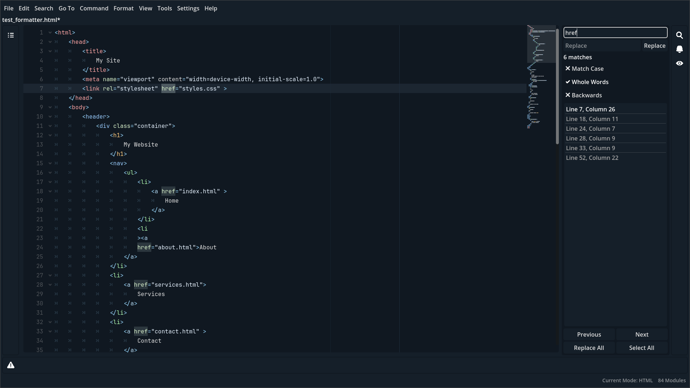

# Text Forge - Simplicity to start, power to grow!
Extensible and modular code editor with Godot 4.5

---

## Overview

**Text Forge** is a lightweight, modular code editor designed for flexibility and control. Its mode-driven design, customizable interface, and support for GDScript scripting make it easy to create a personalized editing environment.

Language-agnostic and suitable for any text format, Text Forge features a data-driven, object-oriented architecture. Its plug-and-play system lets you extend functionality without touching the core.

 ^ Text Forge screenshot: HTML mode, Find & Replace panel. Auto-formatted HTML (from [input](docs/img/auto-formatter-before.png)).

> [!Note]
> This project currently is in development state, **feel free to contribute in any way you like**.

> [!Important]
> Text Forge is receiving frequent updates that may break compatibility with previous versions. Until **1.0-alpha1**, it's recommended to delete the app’s data folder before updating. 

## 👀 New to Text Forge? Start from [Text Forge Introduction](https://text-forge.github.io/docs/introduction/)

## 🗺️ Want to know more? Take an [Overview of Text Forge here](https://github.com/text-forge/text-forge/wiki/Overview)

## 🚀 Ready to install? See [Setup in 5 minutes](https://text-forge.github.io/docs/setup/)

## 🧰 Looking for the Mode Library? See [here](https://github.com/text-forge/mode-library)

> If you like read more about modes you can see [here](https://text-forge.github.io/docs/modes).

## 📜 The documentation is available online [here](https://text-forge.github.io/docs)

> Text Forge documentation source is available in the `docs/` folder in this repository.

## 🤍 Contributing

All contributions welcome! We have a lot of source and guides for contributing:

- [Code of Conduct](https://github.com/text-forge/text-forge?tab=coc-ov-file)
- [Security Information](https://github.com/text-forge/text-forge?tab=security-ov-file)
- [Contributing Guide](https://text-forge.github.io/docs/contributing/)
- [Contribution Types](https://text-forge.github.io/docs/contribution_types/)
- [Help Wanted Issues](https://github.com/text-forge/text-forge/issues?q=is%3Aissue%20state%3Aopen%20label%3A%22help%20wanted%22)

If you are unsure about your contribution, you can always get help at [discussions](https://github.com/text-forge/text-forge/discussions)!

Also, you can make modes, action scripts, themes, extensions, etc. to improve and customize Text Forge without touching the core. Add `text-forge` tag to your module repo to help others find your work.

## 🔐 License & Credit

MIT 2025 Mahan Khalili and contributors. See full details in the [LICENSE](https://github.com/text-forge/text-forge?tab=MIT-1-ov-file) file.

## Maintainers

This project is a part of [Text Forge Organization](https://github.com/text-forge).

You can get help from this list (or be one of them):

- [Mahan Khalili](https://github.com/mkh-user) - Admin
- [Kuba / WCHC](https://github.com/Wiechciu) - Triage

## Resources & Useful Links

- [Discussions](https://github.com/text-forge/text-forge/discussions) - a place to connect with other members of our community and talk about anything
- [Issues](https://github.com/text-forge/text-forge/issues) - share ideas, features requests, bugs and help others to develop the project
- [Online Docs](https://text-forge.github.io/docs/) - guides for anything about Text Forge
- [Project Wiki](https://github.com/text-forge/text-forge/wiki) - practical guides, examples, and community-driven notes
- [Mode Library](https://github.com/text-forge/mode-library) - fast & lightweight modules to work with any language
- [Mode Support Status](https://github.com/text-forge/mode-library#mode-support-status) - find available and work-in-progress modes

Core concept crafted by Mahan Khalili, with an eye toward modularity, control, and clarity.
